# <div align="center">🚀 **ADITYA KUMAR** 🚀</div>

<div align="center">


</div>

<div align="center">
  
[](https://git.io/typing-svg)

</div>

<div align="center">
  
</div>

<div align="center">

[](https://visitcount.itsvg.in)
[](https://github.com/adityadhimaann)
[](https://linkedin.com/in/adityadhimaann)
[](mailto:dhimanaditya56@gmail.com)
[](https://www.adityakumar-dev.vercel.app)

</div>

---


## </img> **ABOUT THE ARCHITECT**

```typescript
interface Developer {
  name: string;
  location: string;
  education: string;
  experience: string;
  skills: TechStack;
  currentStatus: string[];
  achievements: Achievement[];
}

interface TechStack {
  languages: string[];
  frontend: string[];
  backend: string[];
  databases: string[];
  cloud: string[];
  tools: string[];
}

interface Achievement {
  event?: string;
  platform?: string;
  company?: string;
  rank?: string;
  status?: string;
  impact?: string;
  prize?: string;
  badge?: string;
  result?: string;
}

class AdityaKumar implements Developer {
  readonly name = "Aditya Kumar";
  readonly location = "🏛️ Lucknow, Uttar Pradesh, India";
  readonly education = "🎓 CSE @ Lovely Professional University";
  readonly experience = "💼 Software Development Intern @ L&T";
  
  readonly skills: TechStack = {
    languages: ["Java", "Python", "JavaScript", "TypeScript", "PHP"],
    frontend: ["React.js", "Next.js", "TailwindCSS", "HTML5", "CSS3"],
    backend: ["Node.js", "PHP", "RESTful APIs", "Express.js"],
    databases: ["MySQL", "MongoDB", "PostgreSQL"],
    cloud: ["Google Cloud Platform", "Oracle Cloud", "AWS"],
    tools: ["Git", "VS Code", "Docker", "Postman", "Figma"]
  };
  
  getCurrentStatus(): string[] {
    return [
      "🔭 Building AI-powered applications",
      "🌱 Mastering System Design & Architecture", 
      "💡 Contributing to Open Source",
      "🏆 Competing in coding challenges",
      "🚀 Exploring cutting-edge technologies"
    ];
  }
  
  getAchievements(): Achievement[] {
    return [
      { 
        event: "Gromo-AWS-Sarvam AI Challenge", 
        rank: "Top 50/25000+", 
        prize: "🏆" 
      },
      { 
        platform: "LeetCode", 
        status: "Expert", 
        badge: "⚡" 
      },
      { 
        platform: "CodeChef", 
        status: "Expert", 
        badge: "🔥" 
      },
      { 
        company: "L&T", 
        impact: "40% process optimization", 
        result: "🚀" 
      }
    ];
  }
  
  getMotivation(): string {
    return "Turning coffee into code, one algorithm at a time! ☕→💻";
  }
}

const developer = new AdityaKumar();
console.log(`${developer.name} is ready to change the world! 🌍`);
console.log(developer.getMotivation());
```

<div align="center">
  
</div>

---

##  **TECH ARSENAL**

<div align="center">

### 🚀 **CORE TECHNOLOGIES**

<table align="center">
<tr>
<td align="center" width="120">

<br><strong>Java</strong>
</td>
<td align="center" width="120">

<br><strong>Python</strong>
</td>
<td align="center" width="120">

<br><strong>JavaScript</strong>
</td>
<td align="center" width="120">

<br><strong>TypeScript</strong>
</td>
<td align="center" width="120">

<br><strong>PHP</strong>
</td>
<td align="center" width="120">

<br><strong>C++</strong>
</td>
</tr>
</table>

### 🎨 **FRONTEND MASTERY**

<table align="center">
<tr>
<td align="center" width="120">

<br><strong>React.js</strong>
</td>
<td align="center" width="120">

<br><strong>Next.js</strong>
</td>
<td align="center" width="120">

<br><strong>Tailwind</strong>
</td>
<td align="center" width="120">

<br><strong>HTML5</strong>
</td>
<td align="center" width="120">

<br><strong>CSS3</strong>
</td>
<td align="center" width="120">

<br><strong>SASS</strong>
</td>
</tr>
</table>

### ⚙️ **BACKEND & DATABASE**

<table align="center">
<tr>
<td align="center" width="120">

<br><strong>Node.js</strong>
</td>
<td align="center" width="120">

<br><strong>Express.js</strong>
</td>
<td align="center" width="120">

<br><strong>MySQL</strong>
</td>
<td align="center" width="120">

<br><strong>MongoDB</strong>
</td>
<td align="center" width="120">

<br><strong>PostgreSQL</strong>
</td>
<td align="center" width="120">

<br><strong>REST API</strong>
</td>
</tr>
</table>

### ☁️ **CLOUD & DEVOPS**

<table align="center">
<tr>
<td align="center" width="120">

<br><strong>AWS</strong>
</td>
<td align="center" width="120">

<br><strong>GCP</strong>
</td>
<td align="center" width="120">

<br><strong>Docker</strong>
</td>
<td align="center" width="120">

<br><strong>Kubernetes</strong>
</td>
<td align="center" width="120">

<br><strong>Oracle Cloud</strong>
</td>
<td align="center" width="120">

<br><strong>Nginx</strong>
</td>
</tr>
</table>

### 🛠️ **DEVELOPMENT TOOLS**

<p align="center">

</p>

### 🤖 **AI/ML & APIs**

<div align="center">

[](https://git.io/typing-svg)

</div>

<table align="center">
<tr>
<td align="center" width="120">

<br><strong>TensorFlow</strong>
</td>
<td align="center" width="120">

<br><strong>PyTorch</strong>
</td>
<td align="center" width="120">

<br><strong>Scikit-Learn</strong>
</td>
<td align="center" width="120">

<br><strong>OpenAI API</strong>
</td>
<td align="center" width="120">

<br><strong>Google Gemini</strong>
</td>
<td align="center" width="120">

<br><strong>Pandas</strong>
</td>
</tr>
</table>

</div>

<div align="center">
  
</div>

---

##  **FLAGSHIP PROJECTS**

<div align="center">

<table>
<tr>
<td width="50%" valign="top">

### 🤖 **SamvadGPT** - *AI Conversation Engine*
[](https://github.com/adityadhimaann/samvadgpt)

```yaml
🎯 Impact:
  - Multi-language support (EN/HI/Hinglish)
  - Voice-powered interactions
  - Modern responsive UI/UX
  - Real-time AI responses
  - 95% accuracy in language detection

⚡ Tech Stack:
  - Frontend: Next.js 14, TypeScript, React 18
  - AI: Google Gemini Pro API, OpenAI
  - Styling: TailwindCSS, Framer Motion
  - Features: Speech Recognition, TTS
  - Deployment: Vercel, Edge Functions

📊 Performance:
  - Response Time: <500ms
  - User Engagement: 4.8/5 rating
  - Monthly Active Users: 2.5K+
```

<p align="center">
  
</td>
<td align="center">

</td>
</tr>
<tr>
<td align="center">

</td>
<td align="center">

</td>
<td align="center">

</td>
</tr>
</table>

</div>

---

##  **PROFESSIONAL EXPERIENCE**

<div align="center">

### 🏢 **Larsen & Toubro** | *Software Development Intern*
**📍 Faridabad, Haryana | 📅 June - July 2024**

<table align="center">
<tr>
<td>

```diff
🚀 KEY ACHIEVEMENTS:
+ Developed full-stack Campus Gateway software
+ Served 500+ employees with 99.9% uptime
+ Reduced manual processes by 40%
+ Deployed on IIS Hyper-V infrastructure
+ Implemented automated reporting system
+ Enhanced security protocols by 60%

💻 TECHNOLOGIES USED:
+ Frontend: HTML5, CSS3, JavaScript, Bootstrap
+ Backend: PHP 8.0, MySQL 8.0
+ Infrastructure: IIS Hyper-V, Windows Server
+ Tools: Visual Studio Code, phpMyAdmin
+ Version Control: Git, GitLab

📈 BUSINESS IMPACT:
+ 40% reduction in manual processes
+ 500+ employees served daily
+ 99.9% system uptime achieved
+ 60% improvement in data security
+ 25% faster report generation
+ Enhanced user experience & satisfaction

🏆 RECOGNITION:
+ Outstanding Performance Certificate
+ Recommended for full-time position
+ Mentored 3 junior interns
+ Led code review sessions
```

</td>
</tr>
</table>

</div>

---

##  **ACHIEVEMENTS & CERTIFICATIONS**

<div align="center">

### 🏆 **MAJOR ACHIEVEMENTS**

<table>
<tr>
<td align="center" width="20%">

<br><strong>🥇 Competition Winner</strong>
<br>Top 50/25,000+ in Gromo-AWS-Sarvam AI Challenge
<br><em>National Level Recognition</em>
</td>
<td align="center" width="20%">

<br><strong>⚡ LeetCode Expert</strong>
<br>1800+ Rating | 500+ Problems Solved
<br><em>Advanced Problem Solving</em>
</td>
<td align="center" width="20%">

<br><strong>🔥 CodeChef Expert</strong>
<br>4⭐ Rating | Top 5% Globally
<br><em>Competitive Programming</em>
</td>
<td align="center" width="20%">

<br><strong>💼 L&T Internship</strong>
<br>40% Process Optimization
<br><em>Industry Recognition</em>
</td>
<td align="center" width="20%">

<br><strong>🎓 Academic Excellence</strong>
<br>8.5+ CGPA | Dean's List
<br><em>Consistent Performance</em>
</td>
</tr>
</table>

### 📜 **PROFESSIONAL CERTIFICATIONS**

<div align="center">

| Certification | Provider | Status | Badge |
|---------------|----------|--------|-------|
| 🌠**Responsive Web Design** | FreeCodeCamp | ✅ Certified |  |
| 🔗 **Computer Networking** | Coursera (Google) | ✅ Certified |  |
| ☁️ **Oracle Cloud Infrastructure 2024** | Oracle University | ✅ Certified |  |
| ☕ **Java Programming Mastery** | iamneo | ✅ Certified |  |
| 💬 **Computer Communication** | Coursera (Colorado) | ✅ Certified |  |
| 🤖 **Machine Learning Foundations** | IBM (Coursera) | 🔄 In Progress |  |
| ⚛️ **React Developer Certification** | Meta (Coursera) | 🔄 In Progress |  |

</div>

### 🎯 **SKILL ASSESSMENTS**

<div align="center">

<table>
<tr>
<td align="center">
<strong>💻 Programming</strong><br>
<br>
<br>

</td>
<td align="center">
<strong>🎨 Frontend</strong><br>
<br>
<br>

</td>
<td align="center">
<strong>⚙️ Backend</strong><br>
<br>
<br>

</td>
<td align="center">
<strong>☁️ DevOps</strong><br>
<br>
<br>

</td>
</tr>
</table>

</div>

</div>

---

##  **CODING PROFILES**

<div align="center">

### 🏅 **Competitive Programming Excellence**

<table>
<tr>
<td align="center">

<br>
<strong>LeetCode Expert</strong>
<br>

<br>

<br>
<a href="https://leetcode.com/adityadhimaann">

</a>
</td>
<td align="center">

<br>
<strong>CodeChef Expert</strong>
<br>

<br>

<br>
<a href="https://codechef.com/users/adityadhiman">

</a>
</td>
<td align="center">

<br>
<strong>GeeksforGeeks</strong>
<br>

<br>

<br>
<a href="https://auth.geeksforgeeks.org/user/adityadhiman">

</a>
</td>
<td align="center">

<br>
<strong>HackerRank</strong>
<br>

<br>

<br>
<a href="https://hackerrank.com/adityadhimaann">

</a>
</td>
</tr>
</table>

### 📊 **Coding Statistics**

<div align="center">

[](https://github.com/adityadhimaann)

</div>

<table align="center">
<tr>
<td align="center"><strong>Platform</strong></td>
<td align="center"><strong>Problems Solved</strong></td>
<td align="center"><strong>Rating/Score</strong></td>
<td align="center"><strong>Achievements</strong></td>
</tr>
<tr>
<td align="center">🟠 LeetCode</td>
<td align="center">500+</td>
<td align="center">1800+ (Expert)</td>
<td align="center">Top 15% Globally</td>
</tr>
<tr>
<td align="center">🟤 CodeChef</td>
<td align="center">200+</td>
<td align="center">4⭐ (Expert)</td>
<td align="center">Top 5% Globally</td>
</tr>
<tr>
<td align="center">🟢 GeeksforGeeks</td>
<td align="center">300+</td>
<td align="center">2000+ Score</td>
<td align="center">50+ Articles Published</td>
</tr>
<tr>
<td align="center">🟢 HackerRank</td>
<td align="center">150+</td>
<td align="center">5⭐ Gold</td>
<td align="center">Multiple Gold Badges</td>
</tr>
</table>

</div>

---

##  **2025 ROADMAP & VISION**

<div align="center">

### 🚀 **Strategic Roadmap**

```mermaid
graph TD
    A[🎓 Graduate CSE with Excellence<br/>Target: 9+ CGPA] --> B[🚀 Join Top Tech Company<br/>Target: FAANG/Unicorn]
    B --> C[🧠 Master Advanced AI/ML<br/>Specialization & Certification]
    C --> D[🌟 Lead Open Source Projects<br/>10+ Major Contributions]
    D --> E[🏗️ Launch Tech Startup<br/>AI-Powered Solutions]
    E --> F[🌍 Impact Millions of Lives<br/>Global Scale Innovation]
    
    A --> A1[Complete Final Projects<br/>Build Portfolio]
    B --> B1[Technical Interviews<br/>System Design Mastery]
    C --> C1[Research Publications<br/>Conference Presentations]
    D --> D1[Community Building<br/>Mentorship Programs]
    E --> E1[Funding & Team Building<br/>Product Development]
    F --> F1[IPO/Acquisition<br/>Next Venture]
    
    style A fill:#FF6B6B,stroke:#333,stroke-width:2px,color:#fff
    style B fill:#4ECDC4,stroke:#333,stroke-width:2px,color:#fff
    style C fill:#45B7D1,stroke:#333,stroke-width:2px,color:#fff
    style D fill:#96CEB4,stroke:#333,stroke-width:2px,color:#fff
    style E fill:#FFEAA7,stroke:#333,stroke-width:2px,color:#000
    style F fill:#DDA0DD,stroke:#333,stroke-width:2px,color:#fff
```



### 🎯 **Quarterly Objectives 2025**

<table align="center">
<tr>
<td align="center"><strong>Quarter</strong></td>
<td align="center"><strong>Primary Goals</strong></td>
<td align="center"><strong>Key Metrics</strong></td>
<td align="center"><strong>Progress</strong></td>
<td align="center"><strong>Status</strong></td>
</tr>
<tr>
<td align="center"><strong>Q1 2025</strong></td>
<td align="center">🎓 Complete final year with excellence<br/>🔧 Finish 3 major projects<br/>📚 Master system design</td>
<td align="center">9+ CGPA Target<br/>3 Production Apps<br/>5 System Design Cases</td>
<td align="center"></td>
<td align="center">🟢 On Track</td>
</tr>
<tr>
<td align="center"><strong>Q2 2025</strong></td>
<td align="center">🚀 Secure position at top tech company<br/>💪 Complete advanced certifications<br/>🤝 Build professional network</td>
<td align="center">5+ Job Offers<br/>3 Cloud Certifications<br/>1000+ LinkedIn Connections</td>
<td align="center"></td>
<td align="center">🟡 Planning</td>
</tr>
<tr>
<td align="center"><strong>Q3 2025</strong></td>
<td align="center">🧠 Complete AI/ML specialization<br/>📝 Publish research papers<br/>🎤 Conference presentations</td>
<td align="center">2 Research Papers<br/>3 Conference Talks<br/>Advanced ML Projects</td>
<td align="center"></td>
<td align="center">🟡 Research Phase</td>
</tr>
<tr>
<td align="center"><strong>Q4 2025</strong></td>
<td align="center">🌟 Lead open source initiatives<br/>👥 Mentor junior developers<br/>💡 Startup idea validation</td>
<td align="center">10+ OSS Contributions<br/>50+ Mentees<br/>Market Research Complete</td>
<td align="center"></td>
<td align="center">🟢 Active</td>
</tr>
</table>

### 🏆 **Long-term Vision (2025-2030)**

<div align="center">

[](https://adityakumar-dev.vercel.app/vision)

</div>

<table>
<tr>
<td width="33%" align="center">

<br>
<strong>🏢 Industry Leadership</strong>
<br>
<em>Lead engineering teams at scale<br/>
Drive innovation in AI/ML products<br/>
Mentor next generation developers</em>
</td>
<td width="33%" align="center">

<br>
<strong>🚀 Entrepreneurship</strong>
<br>
<em>Launch AI-powered startup<br/>
Create products impacting millions<br/>
Build sustainable tech ecosystem</em>
</td>
<td width="33%" align="center">

<br>
<strong>🌍 Global Impact</strong>
<br>
<em>Democratize technology access<br/>
Solve real-world problems<br/>
Contribute to open source community</em>
</td>
</tr>
</table>

</div>

---

##  **RANDOM DEV FACTS & LIFESTYLE**

<div align="center">

### 🎵 **Developer Lifestyle**

<table>
<tr>
<td align="center" width="25%">

<br>
<strong>🎵 Currently Jamming To:</strong>
<br>
Lo-fi Hip Hop & Synthwave
<br>
<em>"Perfect coding vibes!"</em>
<br>

</td>
<td align="center" width="25%">

<br>
<strong>☕ Daily Coffee Intake:</strong>
<br>
~5 cups (Debugging Fuel!)
<br>
<em>"while(coffee > 0) { code(); }"</em>
<br>

</td>
<td align="center" width="25%">

<br>
<strong>🌙 Peak Productivity:</strong>
<br>
11 PM - 3 AM
<br>
<em>"Night owl developer mode!"</em>
<br>

</td>
<td align="center" width="25%">

<br>
<strong>🎮 When Not Coding:</strong>
<br>
Chess, Gaming & Tech Podcasts
<br>
<em>"Strategy everywhere!"</em>
<br>

</td>
</tr>
</table>

### 📱 **Tech Setup & Preferences**

<div align="center">

| Category | Current Setup | Rating |
|----------|--------------|--------|
| 💻 **Primary Laptop** | MacBook Pro M2 (Planned) / HP Pavilion | ⭐⭐⭐⭐ |
| 🖥️ **Monitor Setup** | Dual 24" 1080p | ⭐⭐⭐⭐ |
| ⌨️ **Keyboard** | Mechanical (Blue Switches) | ⭐⭐⭐⭐⭐ |
| 🖱️ **Mouse** | Logitech MX Master 3 | ⭐⭐⭐⭐⭐ |
| 🎧 **Headphones** | Sony WH-1000XM4 | ⭐⭐⭐⭐⭐ |
| 🔧 **Primary IDE** | VS Code + Vim | ⭐⭐⭐⭐⭐ |
| 🌐 **Browser** | Chrome DevTools | ⭐⭐⭐⭐ |
| 📱 **Phone** | iPhone 13 Pro | ⭐⭐⭐⭐ |

### 📊 **Weekly Coding Stats**

[](https://github.com/adityadhimaann)

</div>

### 🎯 **Fun Facts & Quirks**

<div align="center">

<table>
<tr>
<td align="center">

```javascript
const adityaQuirks = {
  debuggingStyle: "Rubber duck debugging + coffee",
  favoriteLanguage: "JavaScript (it's everywhere!)",
  codeEditorTheme: "Dark mode forever 🌚",
  musicWhileCoding: "Lo-fi beats to code/relax to",
  preferredCodingTime: "Late night (11PM - 3AM)",
  coffeeToCodeRatio: "1:1 (perfectly balanced)",
  keyboardClicks: "~10,000 per day",
  bugFixCelebration: "Victory dance + another coffee ☕💃"
};

console.log("These quirks make me unique! 🚀");
```

</td>
</tr>
</table>

</div>

</div>

---

##  **LET'S BUILD SOMETHING AMAZING TOGETHER!**

<div align="center">


### 💫 **Ready to Collaborate?**
**I'm always excited to work with fellow innovators, creators, and dreamers!**

[](https://github.com/adityadhimaann)

</div>

<div align="center">

### 🤝 **Connect & Collaborate**

<p>
<a href="https://linkedin.com/in/adityadhimaann" target="_blank">

</a>
<a href="mailto:dhimanaditya56@gmail.com">

</a>
<a href="https://github.com/adityadhimaann" target="_blank">

</a>
<a href="https://adityakumar-dev.vercel.app" target="_blank">

</a>
</p>

<p>
<a href="https://twitter.com/adityadhimaann" target="_blank">

</a>
<a href="https://discord.gg/yourdiscord" target="_blank">

</a>
<a href="https://t.me/adityadhimaann" target="_blank">

</a>
<a href="https://wa.me/your-number" target="_blank">

</a>
</p>

</div>

### 🎯 **What I'm Looking For**

<div align="center">

<table>
<tr>
<td align="center" width="25%">

<br>
<strong>🤝 Collaboration</strong>
<br>
<em>Innovative projects<br/>
Open source contributions<br/>
Tech startups & ventures</em>
</td>
<td align="center" width="25%">

<br>
<strong>🚀 Opportunities</strong>
<br>
<em>Full-stack development roles<br/>
AI/ML engineer positions<br/>
Tech leadership positions</em>
</td>
<td align="center" width="25%">

<br>
<strong>🌐 Networking</strong>
<br>
<em>Industry professionals<br/>
Fellow developers/Status-Live-brightgreen?style=for-the-badge" />
  
  
</p>

</td>
<td width="50%" valign="top">

### 🧠 **AIVA** - *Mental Health AI Assistant*
[](https://github.com/adityadhimaann/aiva)

```yaml
🏆 Achievement:
  - 93% user satisfaction rate
  - Personalized wellness plans
  - Advanced progress tracking
  - 24/7 mental health support
  - Crisis intervention system

🔧 Technology:
  - Frontend: React.js, TailwindCSS, Chakra UI
  - Backend: Node.js, Express.js
  - AI: OpenAI GPT-4, Custom NLP models
  - Database: MongoDB, Redis caching
  - Features: Mood tracking, Meditation guides

📈 Impact:
  - 10K+ wellness sessions conducted
  - 85% improvement in user mood tracking
  - Featured in top mental health apps
```

<p align="center">
  
  
  
</p>

</td>
</tr>
<tr>
<td width="50%" valign="top">

### 🍽️ **Mamta Restaurant** - *Full-Stack Ordering Platform*
[](https://github.com/adityadhimaann/mamta-restaurant)

```yaml
📊 Scale:
  - 750+ daily orders processed
  - Real-time order tracking system
  - Advanced inventory management
  - Multi-language support (3 languages)
  - Kitchen-customer communication hub

🏗️ Architecture:
  - Frontend: React.js 18, Material-UI
  - Backend: Node.js, Express.js, Socket.io
  - Database: MongoDB, Redis
  - Payments: Stripe, Razorpay integration
  - Features: Real-time notifications, Analytics

💼 Business Impact:
  - 60% increase in order efficiency
  - 40% reduction in order errors
  - 99.9% uptime achieved
```

<p align="center">
  
  
  
</p>

</td>
<td width="50%" valign="top">

### 🏆 **BhasaVitt** - *Competition Winner*
[](https://github.com/adityadhimaann/bhasavitt)

```yaml
🥇 Achievement:
  - 🏆 TOP 50 out of 25,000+ participants
  - Multilingual financial literacy AI
  - 87% accuracy in cross-language assessment
  - AWS & Sarvam AI integration
  - National recognition received

🚀 Innovation:
  - NLP: Advanced language processing
  - AI/ML: Custom transformer models
  - Cloud: AWS SageMaker, Lambda
  - Languages: Hindi, English, Tamil
  - Impact: Financial education accessibility

🎯 Recognition:
  - Featured in tech newsletters
  - Industry expert appreciation
  - Open-source community adoption
```

<p align="center">
  
  
  
</p>

</td>
</tr>

<tr>
<td width="50%" valign="top">

### 🚀 **DevConnect** - *Developer Community Platform*
[](https://github.com/adityadhimaann/devconnect)

```yaml
🌟 Features:
  - Developer networking & collaboration
  - Code review system
  - Project showcase platform
  - Skill-based matching algorithm
  - Real-time messaging & video calls

💻 Technology:
  - Frontend: Next.js 14, TypeScript
  - Backend: Node.js, GraphQL, Socket.io
  - Database: PostgreSQL, Redis
  - Auth: NextAuth.js, JWT
  - Real-time: WebRTC, Socket.io

📊 Metrics:
  - 5K+ registered developers
  - 1.2K+ projects showcased
  - 95% positive feedback
```

<p align="center">
  
  
  
</p>

</td>
<td width="50%" valign="top">

### 🎯 **SmartFinance** - *AI Financial Advisor*
[](https://github.com/adityadhimaann/smartfinance)

```yaml
💰 Capabilities:
  - AI-powered investment advice
  - Risk assessment & portfolio optimization  
  - Real-time market data integration
  - Personalized financial planning
  - Expense tracking with ML insights

⚙️ Tech Stack:
  - Frontend: React.js, D3.js, Chart.js
  - Backend: Python, FastAPI, TensorFlow
  - Database: PostgreSQL, InfluxDB
  - APIs: Alpha Vantage, Yahoo Finance
  - ML: Scikit-learn, XGBoost

📈 Results:
  - 89% prediction accuracy
  - $2M+ portfolio value managed
  - 500+ satisfied users
```

<p align="center">
  
  
  
</p>

</td>
</tr>
</table>

<div align="center">

### 🔗 **Quick Project Links**

[](https://adityakumar-dev.vercel.app)
[](https://github.com/adityadhimaann)
[](https://adityakumar-dev.vercel.app/projects)

</div>

</div>

<div align="center">
  
</div>

---

##  **GITHUB ANALYTICS**

<div align="center">

### 📊 **Performance Dashboard**


</div>

<div align="center">

### 🎯 **Language Proficiency**


</div>

<div align="center">

### 📈 **Contribution Graph**

[](https://github.com/adityadhimaann)

</div>

<div align="center">

### 🏆 **GitHub Achievements**

[](https://github.com/adityadhimaann)

</div>

