# Hi there, I'm Aditya Kumar! 👋

<div align="center">
  


</div>

<div align="center">
  
[](https://github.com/yourusername)
[](https://linkedin.com/in/yourprofile)
[](mailto:dhimanaditya56@gmail.com)
[](tel:+916306580926)

</div>

---

## 🚀 About Me

```javascript
const aditya = {
    location: "Lucknow, Uttar Pradesh, India",
    education: "CSE Student @ Lovely Professional University",
    currentStatus: "Building the future with code",
    workingOn: ["AI/ML Projects", "Full Stack Development", "Open Source"],
    learning: ["Advanced React Patterns", "Cloud Architecture", "AI/ML"],
    askMeAbout: ["Web Dev", "AI/ML", "DSA", "System Design"],
    funFact: "I turn coffee into code and ideas into reality! ☕️"
};
```

<div align="center">
  


</div>

---

## 🎯 Current Focus

<div align="center">

🔭 **Currently Working On:** AI-powered applications and full-stack development  
🌱 **Learning:** Advanced AI/ML techniques and cloud technologies  
💼 **Recent Achievement:** Software Development Intern at Larsen & Toubro  
🏆 **Latest Win:** Finalist in Gromo-AWS-Sarvam AI Challenge (Top 50/25,000+)  

</div>

---

## 💼 Experience

### 🏢 Larsen and Toubro | Software Development Intern
**📍 Faridabad, Haryana | 📅 June - July 2025**

```diff
+ Developed and deployed full-stack Campus Gateway software
+ Served 500+ employees with 99.9% uptime
+ Reduced manual processes by 40%
+ Technologies: HTML, CSS, JavaScript, PHP, MySQL, IIS Hyper-V
```

---

## 🛠️ Tech Stack

<div align="center">

### 💻 Programming Languages


### 🎨 Frontend Development


### ⚙️ Backend & Database


### 🛠️ Tools & Platforms


</div>

---

## 🌟 Featured Projects

<div align="center">

<table>
<tr>
<td width="50%">

### 🤖 SamvadGPT
**AI Assistant Web Application**

[](https://github.com/yourusername/samvadgpt)

🔥 **Features:**
- Modern chat interface
- Voice input/output
- Multi-language support (EN/HI/Hinglish)
- Built with Next.js & Google Gemini AI

**Tech Stack:** `TypeScript` `Next.js` `React` `Gemini AI`

</td>
<td width="50%">

### 🧠 AIVA - AI Virtual Assistant
**Mental Health Chatbot**

[](https://github.com/yourusername/aiva)

🎯 **Impact:**
- 90% user satisfaction rate
- Personalized wellness recommendations
- Meditation guides & progress tracking
- OpenAI API integration

**Tech Stack:** `HTML` `TailwindCSS` `JavaScript` `OpenAI`

</td>
</tr>
<tr>
<td width="50%">

### 🍽️ Mamta Restaurant Platform
**Full-Stack Ordering System**

[](https://github.com/yourusername/mamta-restaurant)

📈 **Scale:**
- 500+ daily orders supported
- Real-time order tracking
- Inventory management
- Kitchen-to-customer communication

**Tech Stack:** `React.js` `Node.js` `MongoDB`

</td>
<td width="50%">

### 🏆 BhasaVitt (Competition Winner)
**Multilingual Financial Literacy AI**

🥇 **Achievement:**
- Finalist in Gromo-AWS-Sarvam AI Challenge
- Top 50 out of 25,000+ participants
- 85% accuracy in cross-language assessment
- Multilingual financial education model

**Tech Stack:** `Python` `AI/ML` `NLP` `AWS`

</td>
</tr>
</table>

</div>

---

## 📊 GitHub Analytics

<div align="center">
  


</div>

<div align="center">
  
[](https://git.io/streak-stats)

</div>

---

## 🏆 Achievements & Certifications

<div align="center">

### 🎖️ Honors & Awards
```
🏅 Finalist in Gromo-AWS-Sarvam AI Challenge (Top 50/25,000+)
🔥 LeetCode Expert
⭐ CodeChef Expert  
💪 Strong DSA Foundation
```

### 📜 Certifications
- 🌐 **Responsive Web Design** - FreeCodeCamp
- 🔗 **Computer Networking** - Coursera
- ☁️ **Oracle Cloud Infrastructure 2025 Certified Foundations Associate**
- ☕ **Java Programming Certification** - iamneo
- 💬 **Computer Communication** - Coursera

</div>

---

## 🎮 Coding Profiles

<div align="center">

[](https://leetcode.com/yourusername)
[](https://codechef.com/users/yourusername)
[](https://auth.geeksforgeeks.org/user/yourusername)

</div>

---

## 📈 Contribution Graph

<div align="center">

[](https://github.com/yourusername)

</div>

---

## 🎯 2025 Goals

```mermaid
graph LR
    A[🎓 Graduate CSE] --> B[🚀 Join Top Tech Company]
    B --> C[🧠 Master AI/ML]
    C --> D[🌟 Contribute to Open Source]
    D --> E[🏗️ Build Impactful Products]
```

<div align="center">



</div>

- 🎓 Complete Computer Science Engineering with excellence
- 🚀 Secure a position at a leading tech company
- 🧠 Deep dive into Advanced AI/ML and Cloud Computing
- 🌟 Contribute more to open source projects
- 🏗️ Build products that make a difference

---

## 💭 Fun Facts

<div align="center">

🎵 **Currently Listening To:** Coding playlists on Spotify  
☕ **Coffee Consumption:** ~4 cups/day (debugging fuel!)  
🌙 **Preferred Coding Time:** Late night (when the world is quiet)  
🎮 **When Not Coding:** Playing chess or exploring new tech  
📚 **Reading:** Tech blogs, AI research papers, sci-fi novels  

</div>

---

## 🤝 Let's Connect!

<div align="center">

**I'm always excited to collaborate on innovative projects and connect with fellow developers!**

[](https://linkedin.com/in/yourprofile)
[](https://github.com/yourusername)
[](mailto:dhimanaditya56@gmail.com)
[](https://yourportfolio.com)

</div>

---

<div align="center">

### Show some ❤️ by starring some repositories!


**⭐ Star this repo if you like my profile!**

</div>

---

<div align="center">
  
*"Code is like humor. When you have to explain it, it's bad."* – Cory House

**Happy Coding! 🚀**

</div>
