# <div align="center">🚀 **ADITYA KUMAR** 🚀</div>

<div align="center">


</div>

<div align="center">
  
[](https://git.io/typing-svg)

</div>

<div align="center">
  
</div>

<div align="center">

[](https://visitcount.itsvg.in)
[](https://github.com/adityadhimaann)
[](https://linkedin.com/in/adityadhimaann)
[](mailto:dhimanaditya56@gmail.com)
[](https://www.adityakumar-dev.vercel.app)

</div>

---


## </img> **ABOUT THE ARCHITECT**

```typescript
class AdityaKumar implements Developer, Innovator, ProblemSolver {
  readonly name = "Aditya Kumar";
  readonly location = "🏛️ Lucknow, Uttar Pradesh, India";
  readonly education = "🎓 CSE @ Lovely Professional University";
  readonly experience = "💼 Software Development Intern @ L&T";
  
  private skills: TechStack = {
    languages: ["Java", "Python", "JavaScript", "TypeScript", "PHP"],
    frontend: ["React.js", "Next.js", "TailwindCSS", "HTML5", "CSS3"],
    backend: ["Node.js", "PHP", "RESTful APIs"],
    databases: ["MySQL", "MongoDB"],
    cloud: ["Google Cloud Platform", "Oracle Cloud"],
    tools: ["Git", "VS Code", "Docker", "Postman"]
  };
  
  getCurrentStatus(): string[] {
    return [
      "🔭 Building AI-powered applications",
      "🌱 Mastering System Design & Architecture",
      "💡 Contributing to Open Source",
      "🏆 Competing in coding challenges"
    ];
  }
  
  getAchievements(): Achievement[] {
    return [
      { event: "Gromo-AWS-Sarvam AI Challenge", rank: "Top 50/25000+", prize: "🏆" },
      { platform: "LeetCode", status: "Expert", badge: "⚡" },
      { platform: "CodeChef", status: "Expert", badge: "🔥" },
      { company: "L&T", impact: "40% process optimization", result: "🚀" }
    ];
  }
}

const developer = new AdityaKumar();
console.log(`${developer.name} is ready to change the world! 🌍`);
```

<div align="center">
  
</div>

---

##  **TECH ARSENAL**

<div align="center">

### 🚀 **CORE TECHNOLOGIES**

<table align="center">
<tr>
<td align="center" width="150">

<br><strong>Java</strong>
</td>
<td align="center" width="150">

<br><strong>Python</strong>
</td>
<td align="center" width="150">

<br><strong>JavaScript</strong>
</td>
<td align="center" width="150">

<br><strong>TypeScript</strong>
</td>
<td align="center" width="150">

<br><strong>PHP</strong>
</td>
</tr>
</table>

### 🎨 **FRONTEND MASTERY**

<table align="center">
<tr>
<td align="center" width="150">

<br><strong>React.js</strong>
</td>
<td align="center" width="150">

<br><strong>Next.js</strong>
</td>
<td align="center" width="150">

<br><strong>Tailwind</strong>
</td>
<td align="center" width="150">

<br><strong>HTML5</strong>
</td>
<td align="center" width="150">

<br><strong>CSS3</strong>
</td>
</tr>
</table>

### ⚙️ **BACKEND & DATABASE**

<table align="center">
<tr>
<td align="center" width="150">

<br><strong>Node.js</strong>
</td>
<td align="center" width="150">

<br><strong>MySQL</strong>
</td>
<td align="center" width="150">

<br><strong>MongoDB</strong>
</td>
<td align="center" width="150">

<br><strong>GCP</strong>
</td>
<td align="center" width="150">

<br><strong>Docker</strong>
</td>
</tr>
</table>

### 🛠️ **DEVELOPMENT TOOLS**

<p align="center">

</p>

</div>

<div align="center">
  
</div>

---

##  **FLAGSHIP PROJECTS**

<div align="center">

<table>
<tr>
<td width="50%" valign="top">

### 🤖 **SamvadGPT** - *AI Conversation Engine*
[](https://github.com/yourusername/samvadgpt)

```yaml
🎯 Impact:
  - Multi-language support (EN/HI/Hinglish)
  - Voice-powered interactions
  - Modern chat interface
  - Real-time AI responses

⚡ Tech Stack:
  - Frontend: Next.js, TypeScript, React
  - AI: Google Gemini API
  - Styling: TailwindCSS
  - Features: Voice I/O, Multi-lang
```

<p align="center">
  
  
</p>

</td>
<td width="50%" valign="top">

### 🧠 **AIVA** - *Mental Health AI Assistant*
[](https://github.com/yourusername/aiva)

```yaml
🏆 Achievement:
  - 90% user satisfaction rate
  - Personalized wellness plans
  - Progress tracking system
  - Mental health support

🔧 Technology:
  - Frontend: HTML5, TailwindCSS
  - Backend: JavaScript, OpenAI API
  - Features: Meditation guides, Analytics
  - Impact: Mental wellness support
```

<p align="center">
  
  
</p>

</td>
</tr>
<tr>
<td width="50%" valign="top">

### 🍽️ **Mamta Restaurant** - *Full-Stack Ordering Platform*
[](https://github.com/yourusername/mamta-restaurant)

```yaml
📊 Scale:
  - 500+ daily orders processed
  - Real-time order tracking
  - Inventory management system
  - Kitchen-customer communication

🏗️ Architecture:
  - Frontend: React.js, Responsive Design
  - Backend: Node.js, Express.js
  - Database: MongoDB
  - Features: Real-time updates, Analytics
```

<p align="center">
  
  
</p>

</td>
<td width="50%" valign="top">

### 🏆 **BhasaVitt** - *Competition Winner*
[](https://github.com/yourusername/bhasavitt)

```yaml
🥇 Achievement:
  - TOP 50 out of 25,000+ participants
  - Multilingual financial literacy AI
  - 85% accuracy in cross-language assessment
  - AWS & Sarvam AI integration

🚀 Innovation:
  - NLP: Advanced language processing
  - AI/ML: Custom model training
  - Cloud: AWS infrastructure
  - Impact: Financial education accessibility
```

<p align="center">
  
  
</p>

</td>
</tr>
</table>

</div>

<div align="center">
  
</div>

---

##  **GITHUB ANALYTICS**

<div align="center">


</div>

<div align="center">


</div>

<div align="center">

[](https://github.com/yourusername)

</div>

<div align="center">

### 🏆 **GitHub Trophies**
[](https://github.com/yourusername)

</div>

---

##  **PROFESSIONAL EXPERIENCE**

<div align="center">

### 🏢 **Larsen & Toubro** | *Software Development Intern*
**📍 Faridabad, Haryana | 📅 June - July 2025**

<table align="center">
<tr>
<td>

```diff
🚀 KEY ACHIEVEMENTS:
+ Developed full-stack Campus Gateway software
+ Served 500+ employees with 99.9% uptime
+ Reduced manual processes by 40%
+ Deployed on IIS Hyper-V infrastructure

💻 TECHNOLOGIES USED:
+ Frontend: HTML5, CSS3, JavaScript
+ Backend: PHP, MySQL
+ Infrastructure: IIS Hyper-V
+ Performance: 99.9% uptime achieved

📈 BUSINESS IMPACT:
+ 40% reduction in manual processes
+ 500+ employees served daily
+ Improved operational efficiency
+ Enhanced user experience
```

</td>
</tr>
</table>

</div>

---

##  **ACHIEVEMENTS & CERTIFICATIONS**

<div align="center">

### 🏆 **MAJOR ACHIEVEMENTS**

<table>
<tr>
<td align="center" width="25%">

<br><strong>🥇 Competition Winner</strong>
<br>Top 50/25,000+ in Gromo-AWS-Sarvam AI Challenge
</td>
<td align="center" width="25%">

<br><strong>⚡ LeetCode Expert</strong>
<br>Advanced Problem Solving Skills
</td>
<td align="center" width="25%">

<br><strong>🔥 CodeChef Expert</strong>
<br>Competitive Programming Excellence
</td>
<td align="center" width="25%">

<br><strong>💼 L&T Internship</strong>
<br>40% Process Optimization
</td>
</tr>
</table>

### 📜 **CERTIFICATIONS**

<div align="center">

| Certification | Provider | Badge |
|---------------|----------|--------|
| 🌠Responsive Web Design | FreeCodeCamp |  |
| 🔗 Computer Networking | Coursera |  |
| ☁️ Oracle Cloud Infrastructure 2025 | Oracle |  |
| ☕ Java Programming | iamneo |  |
| 💬 Computer Communication | Coursera |  |

</div>

</div>

---

##  **CODING PROFILES**

<div align="center">

<table>
<tr>
<td align="center">

<br>
<strong>LeetCode Expert</strong>
<br>
<a href="https://leetcode.com/yourusername">

</a>
</td>
<td align="center">

<br>
<strong>CodeChef Expert</strong>
<br>
<a href="https://codechef.com/users/yourusername">

</a>
</td>
<td align="center">

<br>
<strong>GeeksforGeeks</strong>
<br>
<a href="https://auth.geeksforgeeks.org/user/yourusername">

</a>
</td>
<td align="center">

<br>
<strong>HackerRank</strong>
<br>
<a href="https://hackerrank.com/yourusername">

</a>
</td>
</tr>
</table>

</div>

---

##  **2025 ROADMAP**

<div align="center">



</div>

<div align="center">

```mermaid
graph TD
    A[🎓 Graduate CSE with Excellence] --> B[🚀 Join FAANG Company]
    B --> C[🧠 Master Advanced AI/ML]
    C --> D[🌟 Lead Open Source Projects]
    D --> E[🏗️ Launch Tech Startup]
    E --> F[🌍 Impact Millions of Lives]
    
    style A fill:#FF6B6B
    style B fill:#4ECDC4
    style C fill:#45B7D1
    style D fill:#96CEB4
    style E fill:#FFEAA7
    style F fill:#DDA0DD
```

### 🎯 **KEY OBJECTIVES FOR 2025**

| Quarter | Goals | Status |
|---------|-------|---------|
| Q1 | 📠Complete final year with 9+ CGPA |  |
| Q2 | 🚀 Land a position at top tech company |  |
| Q3 | 🧠 Complete Advanced AI/ML specialization |  |
| Q4 | 🌟 Contribute to 10+ open source projects |  |

</div>

---

##  **RANDOM DEV FACTS**

<div align="center">

<table>
<tr>
<td align="center">

<br>
<strong>🎵 Currently Jamming To:</strong>
<br>
Lo-fi Hip Hop & Synthwave
<br>
<em>"Perfect coding vibes!"</em>
</td>
<td align="center">

<br>
<strong>☕ Daily Coffee Intake:</strong>
<br>
~4 cups (Debugging Fuel!)
<br>
<em>"Coffee++ while(bugs > 0)"</em>
</td>
</tr>
<tr>
<td align="center">

<br>
<strong>🌙 Peak Productivity:</strong>
<br>
11 PM - 3 AM
<br>
<em>"Night owl developer mode!"</em>
</td>
<td align="center">

<br>
<strong>🎮 When Not Coding:</strong>
<br>
Chess & Tech Podcasts
<br>
<em>"Strategy in games = Strategy in code"</em>
</td>
</tr>
</table>

</div>

---

##  **LET'S BUILD SOMETHING AMAZING TOGETHER!**

<div align="center">


**Ready to collaborate on groundbreaking projects?**  
**I'm always excited to work with fellow innovators and creators!**

</div>

<div align="center">

### 🤝 **Connect With Me**

<p>
<a href="https://linkedin.com/in/yourprofile"></a>
<a href="mailto:dhimanaditya56@gmail.com"></a>
<a href="https://github.com/yourusername"></a>
<a href="https://yourportfolio.com"></a>
<a href="https://twitter.com/yourusername"></a>
<a href="https://discord.com/users/yourid"></a>
</p>

</div>

---

<div align="center">

### 📊 **Profile Engagement**


<br>

**💡 "The best way to predict the future is to invent it." - Alan Kay**

<br>


</div>

<div align="center">


</div>

<div align="center">

### ⭐ **Show some love by starring repositories you find interesting!** ⭐

**Made with ❤️ by Aditya Kumar | Happy Coding! 🚀**

</div>
